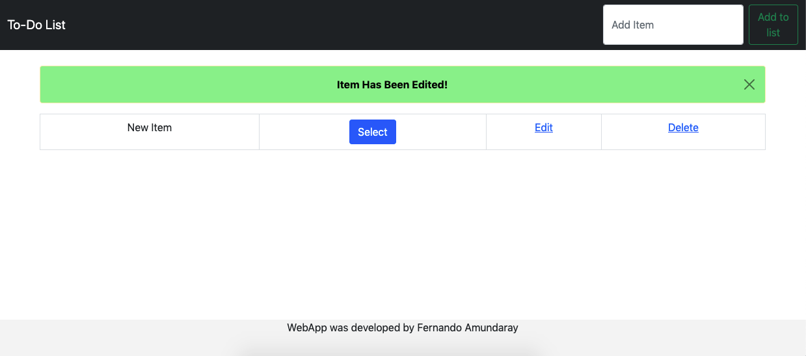

[![LinkedIn][linkedin-shield]][linkedin-url]


<!-- PROJECT LOGO -->
<br />
<p align="center">
  <a>
    
  </a>

  <h3 align="center">To-Do List README</h3>

  <p align="center">
    This is the guide how to run To-Do List WebApp
    <br />
  </p>
</p>


<!-- TABLE OF CONTENTS -->
<details open="open">
  <summary>Table of Contents</summary>
  <ol>
    <li>
      <a href="#about-the-project">About The Project</a>
      <ul>
        <li><a href="#built-with">Built With</a></li>
      </ul>
    </li>
    <li>
      <a href="#getting-started">Getting Started</a>
      <ul>
        <li><a href="#prerequisites">Prerequisites</a></li>
        <li><a href="#installation">Installation</a></li>
      </ul>
    </li>
    <li><a href="#usage">Usage</a></li>
    <li><a href="#roadmap">Roadmap</a></li>
    <li><a href="#contributing">Contributing</a></li>
    <li><a href="#license">License</a></li>
    <li><a href="#contact">Contact</a></li>
    <li><a href="#acknowledgements">Acknowledgements</a></li>
  </ol>
</details>


<!-- ABOUT THE PROJECT -->
## About The Project

This is a simple project to add, edit and delete tasks and add them to a list

### Built With

This section should list any major frameworks that you built your project using. Leave any add-ons/plugins for the acknowledgements section. Here are a few examples.
* [Bootstrap](https://getbootstrap.com)
* [Django](https://www.djangoproject.com)


<!-- GETTING STARTED -->
## Getting Started

This project was designed to make a simple to-do list and developed in Mac Os enviorement

### Prerequisites

You must have installed the last versions of
* Python


### Installation

1. Get a free API Key at [https://github.com/fernandojal/ToDoList](https://github.com/fernandojal/ToDoList)
2. Clone the repo
   ```sh
   git clone https://github.com/fernandojal/ToDoList.git
   ```
3. Open Terminal and look for /ToDoList directory
   ```sh
   cd $/ToDoList

   cd to_do
   ```
4. Then to start app copy and paste in same terminal:
   ```sh
   bash app.sh
   ```
5. Then open your browser and type the url given in terminal for example (http://127.0.0.1:8000/)

<!-- USAGE EXAMPLES -->
## Usage

First you must open the app Homepage

<a>
    
</a></br>

Then you can add an item

<a>
    
</a>

Item must be displayed and give you 3 options to do: Select/Unselect, Edit, Delete
* Select/Unselect option will mark/unmark the entire file to show the item has been selected/unselected
* Edit option will give you a the opportunity to edit Item content
* Delete option will delete permantly the item from database

Note: When you add, edit or delete an item, the system will show you a message that the action is completed succefully

<a>
    
</a>

<a>
    
</a>

<a>
    
</a>

<a>
    
</a>

<a>
    
</a>

<a>
    
</a>


<!-- LICENSE -->
## License

Distributed under the Apache License. See `LICENSE` for more information.


<!-- CONTACT -->
## Contact

Fernando Amundaray - fernandojal.une@gmail.com

Project Link: [https://github.com/fernandojal/ToDoList](https://github.com/fernandojal/ToDoList)


<!-- MARKDOWN LINKS & IMAGES -->
[linkedin-shield]: https://img.shields.io/badge/-LinkedIn-black.svg?style=for-the-badge&logo=linkedin&colorB=555
[linkedin-url]: https://www.linkedin.com/in/fernando-amundaray

